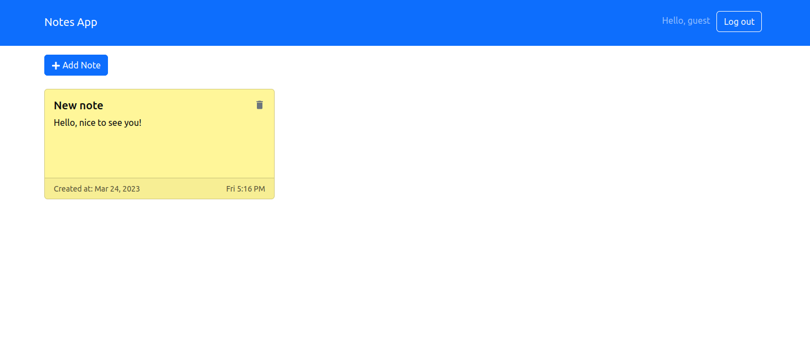

<h1 align="center">Note app</h1>

<h4 align="center">Create individual notes and store them in one place, so that you can access them whenever you need them. With Note App, you'll never forget any important task or information again.</h4>

  <a href="#key-features">Key Features</a> &#x2022;
  <a href="#usage">Usage</a> &#x2022;
  <a href="#screenshot">Screenshot</a> &#x2022;
  <a href="#technologies">Technologies</a> &#x2022;
  <a href="#services">Services</a> 

## Key Features

* Creating, editing, deleting individual notes.
* Simple and user friendly.

## Usage

Log in on the website to get access to your notes.

## Screenshot

## Technologies
- JavaScript
- TypeScript

### Frontend
- Vite
- Bootstrap
- React

### Backend
- Express
- Bcrypt, Express-session
- Mongoose

## Services
- Mongo
- Render
